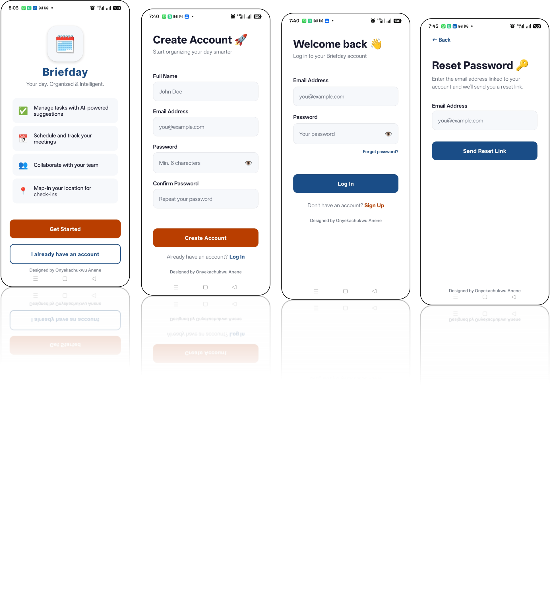
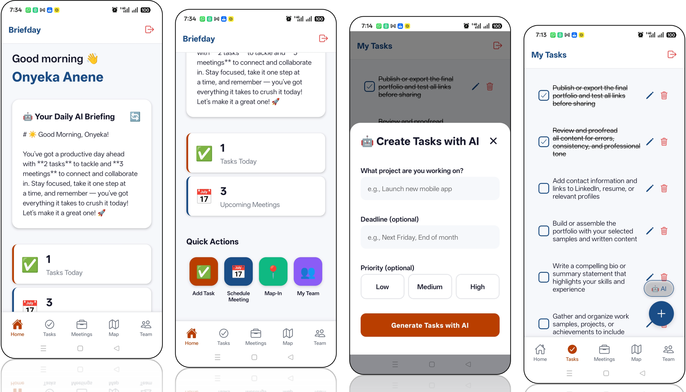

# 📅 Briefday — AI-Powered Productivity App

> A React Native mobile app that helps you organize your day with intelligent task management, meeting scheduling, and personalized AI briefings — built to solve my own productivity struggles.

> 🎥 **Live Demo Available** — Download the Expo preview link to test on your device instantly.

---

## 🚀 Why I Built This

Traditional to-do apps felt robotic — they store tasks but don't help you understand your day. I wanted something smarter: an app that reads my schedule each morning and tells me what to focus on, breaks down big projects into bite-sized tasks, and syncs seamlessly across devices.

Briefday is that app. It combines **React Native, Expo, Firebase, and Claude AI** to deliver a productivity experience that actually feels intelligent.

---

## ✨ Features

| Feature | Description |
|---|---|
| 🤖 AI Daily Briefing | Personalized morning summary of your day based on tasks and meetings |
| ✨ AI Task Generator | Describe a project → AI breaks it into actionable steps |
| ✅ Task Management | Create, edit, complete, and delete tasks with reminders |
| 📅 Meeting Scheduler | Schedule meetings with date/time and track completion |
| 🔔 Smart Reminders | Get notified for upcoming tasks and meetings |
| 🔐 Firebase Auth | Secure email/password authentication |
| ☁️ Cloud Sync | All data saved to Firestore — access from any device |
| 📊 Live Statistics | Dashboard shows active tasks, upcoming meetings at a glance |
| 📱 Native Mobile Experience | Built with React Native for smooth iOS/Android performance |
| 🎨 Modern UI | Clean design with custom color palette and spacing system |

---

## 📸 Screenshots

### Auth Flow


### Main App



---

## 🎬 App Walkthrough

### Welcome & Authentication
Clean onboarding flow with Firebase email/password authentication. Password reset functionality built in.

### Home Dashboard — Your command center
- **Personalized greeting** that changes based on time of day
- **AI Daily Briefing** — Claude analyzes your schedule and gives you a motivating 2-3 sentence overview
- **Live stats cards** showing active tasks and upcoming meetings
- **Quick action buttons** to jump directly to any feature

### Tasks Screen — Intelligent task management
- Add tasks manually with optional reminders
- **🤖 AI Task Generator** — describe a project, AI breaks it into 5-7 actionable subtasks
- Mark tasks complete with a satisfying checkmark
- Edit or delete with swipe actions
- Real-time sync with Firestore

### Meetings Screen — Never miss a meeting
- Schedule meetings with date/time picker
- Track meeting completion status
- Full CRUD operations with cloud backup

### Map-In & My Team (Coming Soon)
Placeholder screens for location check-in and team collaboration features.

---

## 🛠️ Tech Stack

```
Framework      React Native (Expo SDK 52)
Language       JavaScript
Auth           Firebase Authentication
Database       Cloud Firestore with real-time sync
AI Engine      Anthropic Claude Sonnet 4
UI Library     React Native Components + Expo Vector Icons
Date Handling  Day.js
Navigation     React Navigation (Stack + Bottom Tabs)
Notifications  Expo Notifications
State Mgmt     React Hooks + Custom Hooks (useTasks, useMeetings)
Deployment     Expo EAS Build → Google Play Store
```

### Architecture Decisions

- **Expo over bare React Native** — Faster development with managed workflow, OTA updates, and simplified build process. No need to touch native code for core features.

- **Firebase Firestore** — Real-time NoSQL database with built-in offline support. Data syncs automatically when the user comes back online. Row-level security through Firestore rules ensures users only see their own data.

- **Custom Hooks Pattern** — `useTasks` and `useMeetings` encapsulate all Firestore logic (add, update, delete, real-time subscriptions). Screens stay clean and focused on UI.

- **Claude AI Integration** — Anthropic's API generates contextual briefings and task breakdowns. Mock responses included for development without API costs.

- **Component-driven architecture** — Reusable components (`PrimaryButton`, `StatsCard`, `ActionButton`) ensure consistency and make the codebase maintainable.

- **Theme constants** — All colors, fonts, and spacing values defined in `constants/theme.js`. Changing the entire app's look requires editing one file.

---

## 📁 Project Structure

```
Briefday/
├── app/
│   └── App.js                     # Root component
│
├── assets/                        # Images, icons, fonts
│   ├── icon.png
│   ├── splash.png
│   └── adaptive-icon.png
│
├── components/
│   ├── buttons/
│   │   ├── PrimaryButton.js       # Reusable button with variants
│   │   └── ActionButton.js        # Quick action tile
│   ├── modals/
│   │   └── AITaskModal.js         # AI task generation flow
│   ├── AIBriefing.js              # Daily AI summary card
│   ├── Greeting.js                # Time-based greeting
│   ├── StatsCard.js               # Dashboard stats display
│   └── CreditTag.js               # Designer attribution
│
├── config/
│   └── firebase.js                # Firebase initialization
│
├── constants/
│   └── theme.js                   # Colors, fonts, spacing
│
├── hooks/
│   ├── useTasks.js                # Task CRUD + real-time listener
│   └── useMeetings.js             # Meeting CRUD + real-time listener
│
├── navigation/
│   ├── AppNavigator.js            # Auth state routing
│   └── TabNavigator.js            # Bottom tab navigation
│
├── screens/
│   ├── auth/
│   │   ├── WelcomeScreen.js       # Landing page
│   │   ├── LoginScreen.js         # Email/password login
│   │   ├── SignupScreen.js        # Account creation
│   │   └── ResetScreen.js         # Password reset
│   └── tabs/
│       ├── HomeScreen.js          # Dashboard with AI briefing
│       ├── TasksScreen.js         # Task management + AI generator
│       ├── MeetingsScreen.js      # Meeting scheduler
│       ├── MapScreen.js           # Location check-in (placeholder)
│       └── TeamScreen.js          # Team collaboration (placeholder)
│
├── .env                           # Environment variables (gitignored)
├── .gitignore
├── app.config.js                  # Expo configuration
├── babel.config.js
├── package.json
└── README.md
```

---

## 🗺️ Roadmap

### ✅ Completed
- [x] Core task and meeting management
- [x] Firebase authentication and cloud sync
- [x] AI daily briefing
- [x] AI task breakdown generator

### 🔜 Coming Soon
- [ ] Push notifications for task reminders
- [ ] Map-In: Location-based check-ins for meetings
- [ ] Team collaboration: Share tasks with teammates
- [ ] Natural language task entry ("Call John tomorrow at 3pm")
- [ ] Weekly/monthly productivity reports
- [ ] Google Calendar integration
- [ ] Dark mode
- [ ] iOS TestFlight beta

---

## 🙏 Acknowledgments

- **Anthropic Claude** for powering the AI features
- **Firebase** for authentication and real-time database
- **Expo** for making React Native development a joy

---

## 🏃 Running Locally

### Prerequisites
- Node.js 18+
- Expo CLI: `npm install -g expo-cli`
- Expo Go app on your phone ([iOS](https://apps.apple.com/app/expo-go/id982107779) | [Android](https://play.google.com/store/apps/details?id=host.exp.exponent))
- A free [Firebase](https://firebase.google.com) account
- (Optional) An [Anthropic API key](https://console.anthropic.com) for real AI features

### 1. Clone the repo
```bash
git clone https://github.com/yourusername/briefday.git
cd Briefday
npm install
```

### 2. Set up Firebase

**Create a Firebase project:**
1. Go to [firebase.google.com](https://firebase.google.com)
2. Click "Create a project" → name it "Briefday"
3. Register a web app (click the `</>` icon)
4. Copy the config object

**Enable Authentication:**
1. Go to **Authentication** → **Get Started**
2. Enable **Email/Password** sign-in

**Create Firestore Database:**
1. Go to **Firestore Database** → **Create Database**
2. Start in **Test Mode** (we'll secure it before production)
3. Choose a server location close to you

### 3. Configure environment variables

Create **`.env`** in the project root:
```
FIREBASE_API_KEY=AIza...
FIREBASE_AUTH_DOMAIN=briefday-xxxxx.firebaseapp.com
FIREBASE_PROJECT_ID=briefday-xxxxx
FIREBASE_STORAGE_BUCKET=briefday-xxxxx.appspot.com
FIREBASE_MESSAGING_SENDER_ID=123456789
FIREBASE_APP_ID=1:123456789:web:abcdef
ANTHROPIC_API_KEY=sk-ant-your-key-here
```

Replace with your actual Firebase values. Leave `ANTHROPIC_API_KEY` empty to use mock AI responses.

### 4. Update app.config.js

Make sure your Firebase credentials are properly referenced in `app.config.js` (already configured if you followed Step 3).

### 5. Run the app
```bash
npx expo start
```

Scan the QR code with:
- **iOS:** Camera app
- **Android:** Expo Go app

---

## 🔒 Firebase Security Rules

Before deploying to production, update your Firestore rules:

```javascript
rules_version = '2';
service cloud.firestore {
  match /databases/{database}/documents {
    match /tasks/{taskId} {
      allow read, write: if request.auth != null && request.auth.uid == resource.data.userId;
      allow create: if request.auth != null && request.auth.uid == request.resource.data.userId;
    }
    
    match /meetings/{meetingId} {
      allow read, write: if request.auth != null && request.auth.uid == resource.data.userId;
      allow create: if request.auth != null && request.auth.uid == request.resource.data.userId;
    }
  }
}
```

---

## 🚢 Building for Production

### Android APK/AAB
```bash
# Install EAS CLI
npm install -g eas-cli

# Configure build
eas build:configure

# Build for Android
eas build --platform android
```

### Google Play Store Submission
1. Generate a signed APK using EAS Build
2. Create app listing on [Google Play Console](https://play.google.com/console)
3. Upload screenshots (512x512 icon, feature graphic, phone screenshots)
4. Fill in app description, privacy policy, content rating
5. Submit for review

Full guide: [Expo EAS Build Docs](https://docs.expo.dev/build/introduction/)

---

## 👨‍💻 Author

**Built with ❤️ by Onyekachukwu Anene** — Software Engineer (React Native / React / Next.js).
Currently building production-ready mobile and web apps. Available for freelance and full-time opportunities.

[](https://github.com/onyekaanene)
[](https://www.linkedin.com/in/onyekachukwu-anene)
[](https://www.onyekaanene.com/projects)

---

## 📄 License

MIT License — Feel free to fork, learn from, and build upon this project.
